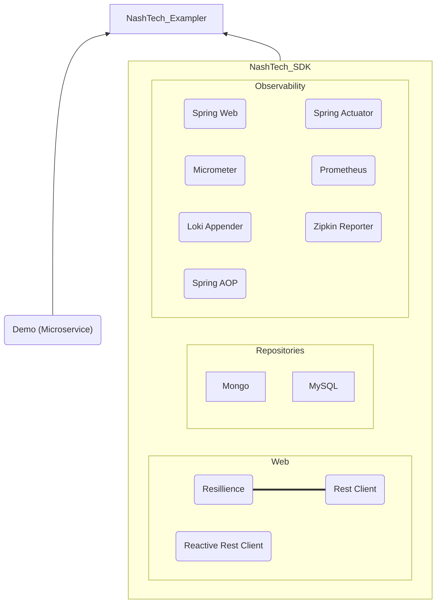

# nashtech-java-core-examplers
Example Project to show the use of Nashtech core sdk

### Overview -
Nashtech Java Core Exampler provides several core modules:

1. [Nashtech-Common-Exampler](nashtech-common-exampler)
2. [Nashtech-Data-Exampler](nashtech-data-exampler)
3. [Nashtech-Data-Mongo-Exampler](nashtech-data-mongo-exampler)
4. [Nashtech-Data-Reactive-Mongo-Exampler](nashtech-data-reactive-mongo-exampler)
5. [Nashtech-Observability-Exampler](nashtech-observability-exampler)
6. [Nashtech-Reactive-Exampler](nashtech-reactive-exampler)
7. [Nashtech-Resilience-Exampler](nashtech-resilience-exampler)
8. [Nashtech-Web-Exampler](nashtech-web-exampler)

