# Nashtech-data-examplers -
The data module provides a comprehensive solution for managing data operations in various databases.

### Overview -
The Data module provides developers with a convenient and efficient means of performing CRUD operations. The module simplifies the process by presenting a wrapper repository, which eliminates the need to configure different drivers in POM. This significantly reduces the amount of time and effort required for developers to manage and maintain multiple databases.

Furthermore, the Data module takes into consideration the activated profile and subsequently loads a suitable database driver. This feature enhances the flexibility and scalability of the module, allowing developers to easily adapt to changing requirements and specifications.

The generic repositories within the Data module are another valuable feature, as they allow for referencing multiple databases such as MySQL, Postgres, and H2 database. This further simplifies database management, enabling developers to quickly and efficiently access the data they require without having to worry about complex configurations or compatibility issues.

Overall, the Data module is a highly effective module for streamlining database management and simplifying the process of performing CRUD operations. Its user-friendly design and compatibility with multiple databases make it an invaluable asset for any software development project, enabling developers to focus on creating innovative and high-quality applications.

### Tech Explanation -

Nashtech Java Core Exampler provides several Datasource:

1. H2 Database - Spring boot project with H2 memory database, performing create, delete, get and update operations. Handling spring boot way global exception handling and Swagger UI for Rest End points.
2. MySql database - MySQL is an RDBMS based on the SQL, which is the popular language for accessing and managing the records in the database.
3. Postgres database - PostgreSQL is one of the most advanced general-purpose object-relational database management system and is open-source. Being an open-source software, its source code is available under PostgreSQL license.

```mermaid
flowchart RL
    subgraph X[NASHTECH DATA EXAMPLER]
        direction LR
        subgraph Y[NASHTECH DATA CORE]
            a0("SPRING DATA JPA")
            direction LR
            subgraph Z[CONNECTORS]
                direction RL
                a1[("H2 Database")] ~~~ a2[("ORACLE")]
                a3[("MySQL")] ~~~ a4[("PostgreSQL")]
                a5[("Microsoft SQL Server")]
            end
        end
    end
    X <===> a[(Database)]

```





How to run the application
1. Navigate to the exampler directory

````
cd nashtech-data-exampler
````
2. Include the following dependency in the pom.xml

````
<dependency>
   <groupId>com.nashtechglobal</groupId>
    <artifactId>nashtech-data</artifactId>
    <version>1.0-SNAPSHOT</version>
 </dependency>
 ````
3. Execute the below docker command to start the database instance

````
docker-compose up -d
````
4.Datasource Configuration is provided by configuration properties entries ( spring.datasource. *) in application-{profile}.properties file. Choose the profile for which you want to load the drivers
- To choose H2 database
   ````
   mvn spring-boot:run -p h2
   ````
- To choose mysql database
   ````
   mvn spring-boot:run -p mysql
   ````
- To choose postgres database
````
   mvn spring-boot:run -p postgres
````
Now, you will be able to access the Data Service and all the function

