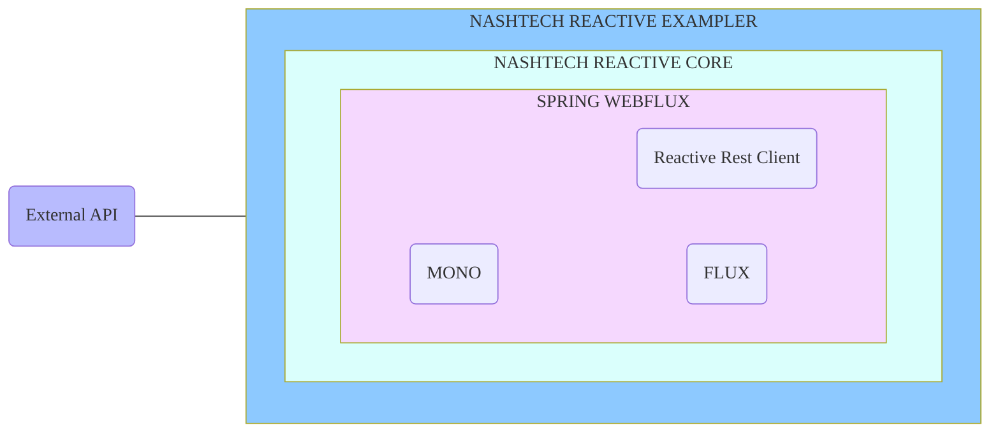

## Reactive Exampler

### Overview -

NashTech Reactive offers two primary functionalities:

1. #### FluxRequestWrapper :

   The `executeFluxApiRequest` method generates a `Flux` of `ResponseEntity` objects. This involves creating a request
   using the web client with the `apiRequest` details provided, and then mapping the client response to
   a `ResponseEntity` object using the specified `responseType`.

2. #### MonoRequestWrapper :

   The `executeMonoApiRequest` method generates a `Mono` of `ResponseEntity` objects. This involves verifying if
   the `apiRequest` object contains a body, creating a request using the web client with the `apiRequest` details
   provided, and setting the body if present. The client response is then mapped to a `ResponseEntity` object using the
   specified `responseType`. If there is no body present, it creates a request without setting the body and then maps
   the client response to a `ResponseEntity` object using the specified `responseType`.


### How to use Nashtech Reactive in your application -

1. We can add dependency of Nashtech reactive in our exampler application

    ```
    <dependency>
       <groupId>com.nashtechglobal</groupId>
       <artifactId>nashtech-reactive</artifactId>
       <version>${project.parent.version}</version>
    </dependency>
    ```

3. You will be able to access the **Reactive Service** and all the function present in it by creating an instance
   of it.
### Endpoints:

- Get all Reactive Entities
  ```
    curl --location --request GET 'http://localhost:8088/exampler/reactive/flux' \
    --header 'Content-Type: application/json' \
    --data '{
    "headers": {},
    "body": {},
    "httpMethod": "GET",
    "url": "http://localhost:8081/reactive/entities"
    }'
  ```
- Get a Reactive Entity by ID ("103")
  ```
    curl --location --request GET 'http://localhost:8088/exampler/reactive/mono' \
    --header 'Content-Type: application/json' \
    --data '{
    "headers": {},
    "body": {},
    "httpMethod": "GET",
    "url": "http://localhost:8081/reactive/entities/103"
    }'
  ```
- Add a new Reactive Entity
  ```
    curl --location --request GET 'http://localhost:8088/exampler/reactive/mono' \
    --header 'Content-Type: application/json' \
    --data '{
    "headers": {
    "Content-Type": "application/json",
    "Connection": "keep-alive"
    },
    "body": {
    "id": "33",
    "testingStringData": "String 1",
    "testingLongData": 1234567890,
    "testingDateData": "2023-04-13T23:58:00.000Z"
    },
    "httpMethod": "POST",
    "url": "http://localhost:8081/reactive/entities"
    }'
  ```
- Update an Existing Reactive Entity by ID ("103")
  ```
    curl --location --request GET 'http://localhost:8088/exampler/reactive/mono' \
    --header 'Content-Type: application/json' \
    --data '{
    "headers": {
    "Content-Type": "application/json",
    "Connection": "keep-alive"
    },
    "body": {
    "id": "103",
    "testingStringData": "Updated String",
    "testingLongData": 989898989898,
    "testingDateData": "2023-04-13T23:58:00.000Z"
    },
    "httpMethod": "PUT",
    "url": "http://localhost:8081/reactive/entities/103"
    }'
  ```
- Delete a Reactive Entity by ID ("103")
  ```
    curl --location --request GET 'http://localhost:8088/exampler/reactive/mono' \
    --header 'Content-Type: application/json' \
    --data '{
    "headers": {},
    "body": {},
    "httpMethod": "DELETE",
    "url": "http://localhost:8081/reactive/entities/103"
    }'
  ```
